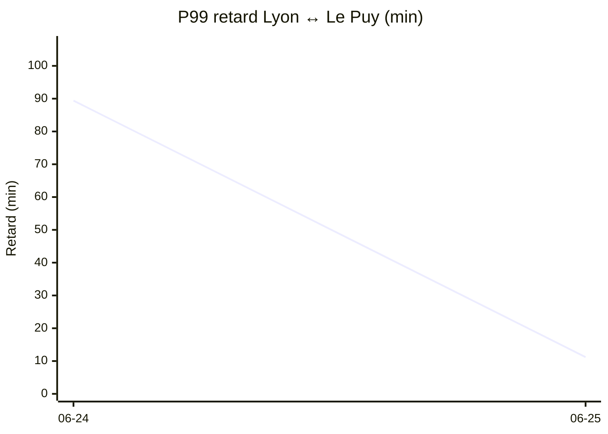

# Statistiques TER Lyon ↔ Le Puy

_Mis à jour le 2026-06-25 17:26 UTC — fenêtre des dernières 24 heures. Trains REGIONAURA uniquement._

## Vue d'ensemble

- **Trains observés** : 141
- **Trains annulés** : 4
- **Trains en retard ≥ 5 min ou annulés** : 31 (22.0 %)

- **Correspondances à St-Étienne Châteaucreux** : 197 analysées, **5 loupées** (2.5 %). Médiane retard ressenti à St-Étienne : 0.0 min.

## Distribution des retards à l'arrivée

_Hors correspondance. Les annulations sont comptées au retard du prochain train de même direction._

**10.6 % des trains arrivent avec un retard supérieur à 5 min.**

| Percentile | Retard |
|---|---|
| 50 % | à l'heure |
| 80 % | ≤ 5 min |
| 90 % | ≤ 10 min |
| 95 % | ≤ 15 min |
| 99 % | ≤ 54 min |

## Focus Lyon ↔ Le Puy (correspondance Saint-Étienne incluse)

42 trajets analysés (les deux sens fusionnés), dont 1 avec correspondance loupée. Le retard est mesuré à la gare d'arrivée finale, en prenant le train de substitution si la correspondance à Saint-Étienne a été ratée.

**4.8 %** des trajets avec un retard d'arrivée > 5 min.

| Percentile | Retard arrivée |
|---|---|
| 50 % | à l'heure |
| 80 % | à l'heure |
| 90 % | à l'heure |
| 95 % | ≤ 5 min |
| 99 % | ≤ 42 min |

## Évolution quotidienne Lyon ↔ Le Puy

Retard à l'arrivée par jour, les deux sens fusionnés. Le retard intègre l'effet d'une correspondance loupée à Saint-Étienne (= attente du prochain train pris).

### P90 par jour _(le 10 % le plus en retard reste sous cette barre)_

```mermaid
xychart-beta
    title "P90 retard Lyon ↔ Le Puy (min)"
    x-axis ["06-24", "06-25"]
    y-axis "Retard (min)" 0 --> 10
    line [0.0, 0.0]
```

### P99 par jour _(le pire 1 %, dominé par les correspondances loupées)_



### Percentiles par jour

| Jour | Trajets | Loupées | P50 | P80 | P90 | P95 | P99 |
|---|---|---|---|---|---|---|---|
| 2026-06-24 | 37 | 2 | à l'heure | à l'heure | à l'heure | 16 min | 89 min |
| 2026-06-25 | 39 | 0 | à l'heure | à l'heure | à l'heure | 1 min | 11 min |

📄 **Listes détaillées** (trains en retard + correspondances) : voir [DETAIL.md](DETAIL.md).
