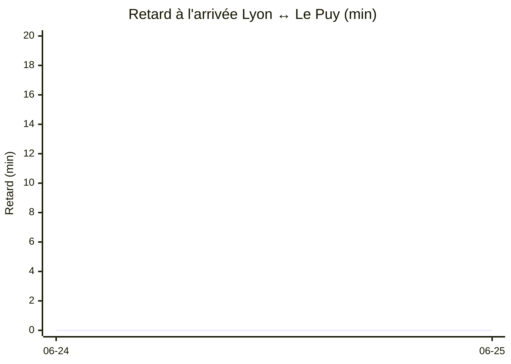

# Statistiques TER Lyon ↔ Le Puy

_Mis à jour le 2026-06-25 14:09 UTC — fenêtre des dernières 24 heures. Trains REGIONAURA uniquement._

## Vue d'ensemble

- **Trains observés** : 172
- **Trains annulés** : 3
- **Trains en retard ≥ 5 min ou annulés** : 32 (18.6 %)

- **Correspondances à St-Étienne Châteaucreux** : 253 analysées, **8 loupées** (3.2 %). Médiane retard ressenti à St-Étienne : 0.0 min.

## Distribution des retards à l'arrivée

_Hors correspondance. Les annulations sont comptées au retard du prochain train de même direction._

**9.3 % des trains arrivent avec un retard supérieur à 5 min.**

| Percentile | Retard |
|---|---|
| 50 % | à l'heure |
| 80 % | à l'heure |
| 90 % | ≤ 5 min |
| 95 % | ≤ 15 min |
| 99 % | ≤ 46 min |

## Focus Lyon ↔ Le Puy (correspondance Saint-Étienne incluse)

53 trajets Lyon ↔ Le Puy analysés (2 avec correspondance loupée). Le retard ci-dessous est mesuré à la gare d'arrivée finale, en prenant le train de substitution si la correspondance à Saint-Étienne a été ratée.

### Lyon → Le Puy

33 trajets, 1 correspondance(s) loupée(s), médiane retard arrivée : 0.0 min.

| % trajets | Retard arrivée |
|---|---|
| 3.0 % | > 5 min |
| 3.0 % | > 15 min |
| 3.0 % | > 30 min |
| 3.0 % | > 45 min |

### Le Puy → Lyon

20 trajets, 1 correspondance(s) loupée(s), médiane retard arrivée : 0.0 min.

| % trajets | Retard arrivée |
|---|---|
| 10.0 % | > 5 min |
| 5.0 % | > 15 min |
| 5.0 % | > 30 min |
| 5.0 % | > 45 min |

## Évolution quotidienne Lyon ↔ Le Puy

Retard médian à l'arrivée par jour, les deux sens fusionnés. La ligne intègre le retard ressenti en cas de correspondance loupée à Saint-Étienne (= attente du prochain train pris).

| Jour | Trajets | Loupées | Médiane retard | P90 retard |
|---|---|---|---|---|
| 2026-06-24 | 37 | 2 | à l'heure | à l'heure |
| 2026-06-25 | 40 | 0 | à l'heure | à l'heure |

## Trains en retard ou annulés

| Train | Jour | Heure prévue | Origine | Destination | Statut | Retard ressenti | Retard à St-Étienne |
|---|---|---|---|---|---|---|---|
| 886265 | 25/06 | 08:38 | Firminy | Lyon Perrache (Lyon) | ANNULÉ | +60 min (train suivant) | — |
| 889962 | 24/06 | 17:17 | Saint-Étienne Châteaucreux | Le Puy-en-Velay (Le Puy-en-Velay) | ANNULÉ | +48 min (train suivant) | — |
| 886857 | 24/06 | 20:20 | Saint-Étienne Châteaucreux | Ambérieu-en-Bugey (Ambérieu-en-Bugey) | Retard | +45 min | +20 min |
| 886207 | 25/06 | 07:01 | Lyon Perrache | Firminy (Firminy) | Retard | +40 min | +40 min |
| 886718 | 25/06 | 11:24 | Lyon Part Dieu | Saint-Étienne Châteaucreux (Saint-Étienn | Retard | +30 min | +30 min |
| 886259 | 25/06 | 07:08 | Firminy | Lyon Perrache (Lyon) | ANNULÉ | +30 min (train suivant) | — |
| 886744 | 24/06 | 19:24 | Lyon Part Dieu | Saint-Étienne Châteaucreux (Saint-Étienn | Retard | +20 min | +20 min |
| 886845 | 24/06 | 16:50 | Saint-Étienne Châteaucreux | Ambérieu-en-Bugey (Ambérieu-en-Bugey) | Retard | +15 min | +15 min |
| 886748 | 24/06 | 20:24 | Lyon Part Dieu | Saint-Étienne Châteaucreux (Saint-Étienn | Retard | +15 min | +10 min |
| 886708 | 25/06 | 07:37 | Ambérieu-en-Bugey | Saint-Étienne Châteaucreux (Saint-Étienn | Retard | +15 min | +15 min |
| 886863 | 25/06 | 08:20 | Saint-Étienne Châteaucreux | Lyon Part Dieu (Lyon) | Retard | +15 min | +10 min |
| 886738 | 24/06 | 17:07 | Ambérieu-en-Bugey | Saint-Étienne Châteaucreux (Saint-Étienn | Retard | +10 min | +10 min |
| 886809 | 25/06 | 07:20 | Saint-Étienne Châteaucreux | Ambérieu-en-Bugey (Ambérieu-en-Bugey) | Retard | +10 min | +10 min |
| 886760 | 25/06 | 11:07 | Ambérieu-en-Bugey | Saint-Étienne Châteaucreux (Saint-Étienn | Retard | +10 min | +10 min |
| 886815 | 25/06 | 09:50 | Saint-Étienne Châteaucreux | Lyon Part Dieu (Lyon) | Retard | +10 min | +10 min |
| 886825 | 25/06 | 12:50 | Saint-Étienne Châteaucreux | Lyon Part Dieu (Lyon) | Retard | +10 min | +10 min |
| 886736 | 24/06 | 17:24 | Lyon Part Dieu | Saint-Étienne Châteaucreux (Saint-Étienn | Retard | +5 min | +5 min |
| 886746 | 24/06 | 19:07 | Ambérieu-en-Bugey | Saint-Étienne Châteaucreux (Saint-Étienn | Retard | +5 min | +5 min |
| 889965 | 24/06 | 19:39 | Le Puy-en-Velay | Saint-Étienne Châteaucreux (Saint-Étienn | Retard | +5 min | +5 min |
| 886712 | 25/06 | 08:37 | Ambérieu-en-Bugey | Saint-Étienne Châteaucreux (Saint-Étienn | Retard | +5 min | +5 min |
| 886714 | 25/06 | 09:07 | Ambérieu-en-Bugey | Saint-Étienne Châteaucreux (Saint-Étienn | Retard | +5 min | +5 min |
| 886724 | 25/06 | 13:24 | Lyon Part Dieu | Saint-Étienne Châteaucreux (Saint-Étienn | Retard | +5 min | +5 min |
| 886726 | 25/06 | 13:07 | Ambérieu-en-Bugey | Saint-Étienne Châteaucreux (Saint-Étienn | Retard | +5 min | +5 min |
| 886762 | 25/06 | 14:24 | Lyon Part Dieu | Saint-Étienne Châteaucreux (Saint-Étienn | Retard | +5 min | +5 min |
| 886728 | 25/06 | 14:07 | Ambérieu-en-Bugey | Saint-Étienne Châteaucreux (Saint-Étienn | Retard | +5 min | +5 min |
| 886871 | 25/06 | 14:20 | Saint-Étienne Châteaucreux | Ambérieu-en-Bugey (Ambérieu-en-Bugey) | Retard | +5 min | +5 min |
| 886837 | 25/06 | 15:20 | Saint-Étienne Châteaucreux | Ambérieu-en-Bugey (Ambérieu-en-Bugey) | Retard | +5 min | +5 min |
| 886801 | 25/06 | 05:20 | Saint-Étienne Châteaucreux | Lyon Part Dieu (Lyon) | Retard | +5 min | +5 min |
| 886821 | 25/06 | 11:50 | Saint-Étienne Châteaucreux | Lyon Part Dieu (Lyon) | Retard | +5 min | +5 min |
| 886257 | 25/06 | 06:38 | Firminy | Lyon Perrache (Lyon) | Retard | +5 min | +5 min |

## Correspondances à St-Étienne Châteaucreux

253 correspondances analysées (toute destination), dont **8 loupées** (gap réel < 5 min). Fenêtre de candidat : 75 min après l'arrivée prévue.

| Jour | Train arr. | Origine | Arr. St-Étienne | Train pris | Destination | Écart prévu | Statut | Retard ressenti |
|---|---|---|---|---|---|---|---|---|
| 25/06 | 886269 | Firminy | 11:00 | 889980 12:58 | Le Puy-en-Velay (Le Puy-en-Velay) | 1 min | LOUPÉE | +117 min |
| 24/06 | 886744 | Lyon Part Dieu | 20:30 (+20m) | 889968 22:00 | Le Puy-en-Velay (Le Puy-en-Velay) | 10 min | LOUPÉE | +100 min |
| 24/06 | 886738 | Ambérieu-en-Bugey | 18:50 (+10m) | 889966 20:20 | Le Puy-en-Velay (Le Puy-en-Velay) | 14 min | LOUPÉE | +86 min |
| 25/06 | 886251 | Firminy | 05:30 | 889952 06:48 | Le Puy-en-Velay (Le Puy-en-Velay) | 1 min | LOUPÉE | +77 min |
| 24/06 | 889965 | Le Puy-en-Velay | 21:18 (+5m) | 886861 22:20 | Lyon Part Dieu (Lyon) | 7 min | LOUPÉE | +60 min |
| 25/06 | 886718 | Lyon Part Dieu | 12:40 (+30m) | 886827 13:20 | Ambérieu-en-Bugey (Ambérieu-en-Bugey) | 10 min | LOUPÉE | +60 min |
| 24/06 | 886744 | Lyon Part Dieu | 20:30 (+20m) | 886245 21:30 | Firminy (Firminy) | 20 min | LOUPÉE | +60 min |
| 25/06 | 886718 | Lyon Part Dieu | 12:40 (+30m) | 886221 13:30 | Firminy (Firminy) | 20 min | LOUPÉE | +60 min |
| 24/06 | 886285 | Firminy | 18:00 | 889982 18:05 | Le Puy-en-Velay (Le Puy-en-Velay) | 5 min | à l'heure | +0 min |
| 25/06 | 886285 | Firminy | 18:00 | 889982 18:05 | Le Puy-en-Velay (Le Puy-en-Velay) | 5 min | à l'heure | +0 min |
| 25/06 | 889951 | Le Puy-en-Velay | 05:58 | 886253 06:04 | Lyon Perrache (Lyon) | 6 min | à l'heure | +0 min |
| 24/06 | 889963 | Le Puy-en-Velay | 17:43 | 886849 17:50 | Ambérieu-en-Bugey (Ambérieu-en-Bugey) | 7 min | à l'heure | +0 min |
| 25/06 | 886732 | Lyon Part Dieu | 17:10 | 889962 17:17 | Le Puy-en-Velay (Le Puy-en-Velay) | 7 min | à l'heure | +0 min |
| 25/06 | 889963 | Le Puy-en-Velay | 17:43 | 886849 17:50 | Ambérieu-en-Bugey (Ambérieu-en-Bugey) | 7 min | à l'heure | +0 min |
| 25/06 | 889965 | Le Puy-en-Velay | 21:13 | 886859 21:20 | Lyon Part Dieu (Lyon) | 7 min | à l'heure | +0 min |
| 24/06 | 886233 | Lyon Perrache | 17:56 | 889982 18:05 | Le Puy-en-Velay (Le Puy-en-Velay) | 9 min | à l'heure | +0 min |
| 25/06 | 886233 | Lyon Perrache | 17:56 | 889982 18:05 | Le Puy-en-Velay (Le Puy-en-Velay) | 9 min | à l'heure | +0 min |
| 24/06 | 886732 | Lyon Part Dieu | 17:10 | 886847 17:20 | Ambérieu-en-Bugey (Ambérieu-en-Bugey) | 10 min | à l'heure | +0 min |
| 24/06 | 886734 | Meximieux - Pérouges | 17:40 | 886849 17:50 | Ambérieu-en-Bugey (Ambérieu-en-Bugey) | 10 min | à l'heure | +0 min |
| 24/06 | 886736 | Lyon Part Dieu | 18:15 (+5m) | 886851 18:20 | Ambérieu-en-Bugey (Ambérieu-en-Bugey) | 10 min | à l'heure | +0 min |
| 24/06 | 886744 | Lyon Part Dieu | 20:30 (+20m) | 886857 20:40 | Ambérieu-en-Bugey (Ambérieu-en-Bugey) | 10 min | à l'heure | +20 min |
| 24/06 | 889979 | Le Puy-en-Velay | 19:10 | 886855 19:20 | Ambérieu-en-Bugey (Ambérieu-en-Bugey) | 10 min | à l'heure | +0 min |
| 25/06 | 886702 | Ambérieu-en-Bugey | 07:40 | 886811 07:50 | Lyon Part Dieu (Lyon) | 10 min | à l'heure | +0 min |
| 25/06 | 886704 | Ambérieu-en-Bugey | 08:10 | 886863 08:30 | Lyon Part Dieu (Lyon) | 10 min | à l'heure | +10 min |
| 25/06 | 886706 | Ambérieu-en-Bugey | 08:40 | 886813 08:50 | Lyon Part Dieu (Lyon) | 10 min | à l'heure | +0 min |
| 25/06 | 886710 | Ambérieu-en-Bugey | 09:40 | 886815 10:00 | Lyon Part Dieu (Lyon) | 10 min | à l'heure | +10 min |
| 25/06 | 886712 | Ambérieu-en-Bugey | 10:15 (+5m) | 886867 10:20 | Lyon Part Dieu (Lyon) | 10 min | à l'heure | +0 min |
| 25/06 | 886714 | Ambérieu-en-Bugey | 10:45 (+5m) | 886817 10:50 | Lyon Part Dieu (Lyon) | 10 min | à l'heure | +0 min |
| 25/06 | 886758 | Lyon Part Dieu | 11:10 | 886869 11:20 | Ambérieu-en-Bugey (Ambérieu-en-Bugey) | 10 min | à l'heure | +0 min |
| 25/06 | 886760 | Ambérieu-en-Bugey | 12:50 (+10m) | 886825 13:00 | Lyon Part Dieu (Lyon) | 10 min | à l'heure | +10 min |
| 25/06 | 886720 | Lyon Part Dieu | 13:10 | 886827 13:20 | Ambérieu-en-Bugey (Ambérieu-en-Bugey) | 10 min | à l'heure | +0 min |
| 25/06 | 886722 | Ambérieu-en-Bugey | 13:40 | 886829 13:50 | Lyon Part Dieu (Lyon) | 10 min | à l'heure | +0 min |
| 25/06 | 886724 | Lyon Part Dieu | 14:15 (+5m) | 886871 14:25 | Ambérieu-en-Bugey (Ambérieu-en-Bugey) | 10 min | à l'heure | +5 min |
| 25/06 | 886726 | Ambérieu-en-Bugey | 14:45 (+5m) | 886833 14:50 | Lyon Part Dieu (Lyon) | 10 min | à l'heure | +0 min |
| 25/06 | 886762 | Lyon Part Dieu | 15:15 (+5m) | 886837 15:25 | Ambérieu-en-Bugey (Ambérieu-en-Bugey) | 10 min | à l'heure | +5 min |
| 25/06 | 886730 | Lyon Part Dieu | 16:10 | 886843 16:20 | Ambérieu-en-Bugey (Ambérieu-en-Bugey) | 10 min | à l'heure | +0 min |
| 25/06 | 886764 | Lyon Part Dieu | 16:40 | 886845 16:50 | Ambérieu-en-Bugey (Ambérieu-en-Bugey) | 10 min | à l'heure | +0 min |
| 25/06 | 886732 | Lyon Part Dieu | 17:10 | 886847 17:20 | Ambérieu-en-Bugey (Ambérieu-en-Bugey) | 10 min | à l'heure | +0 min |
