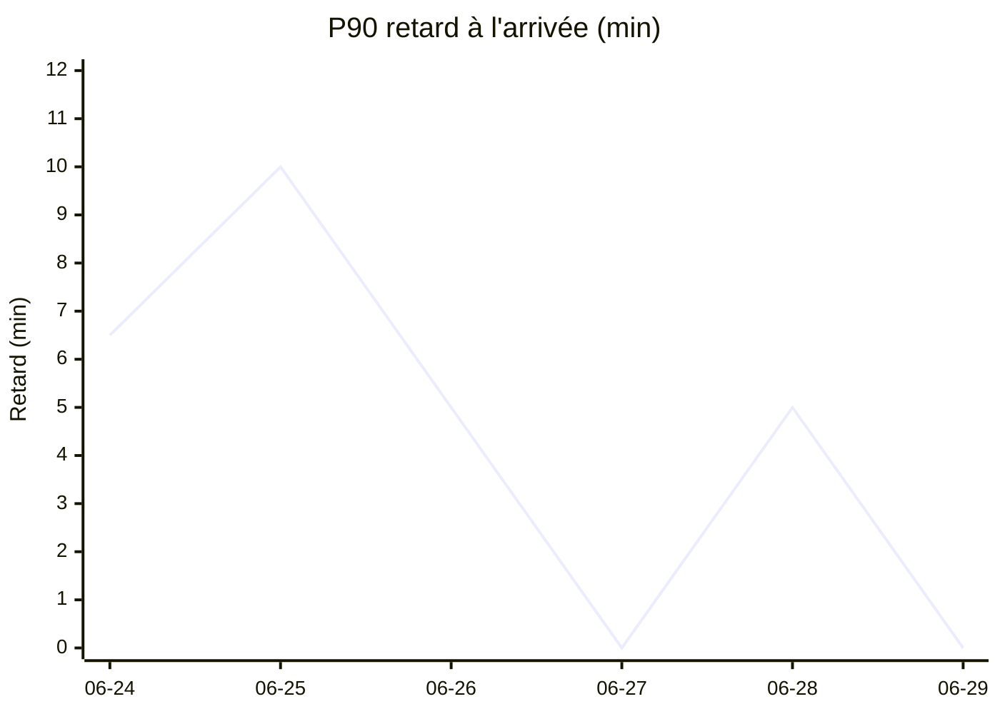
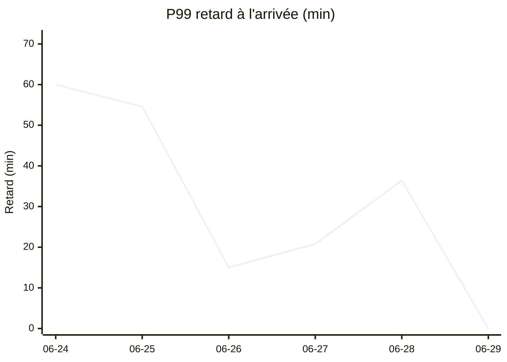
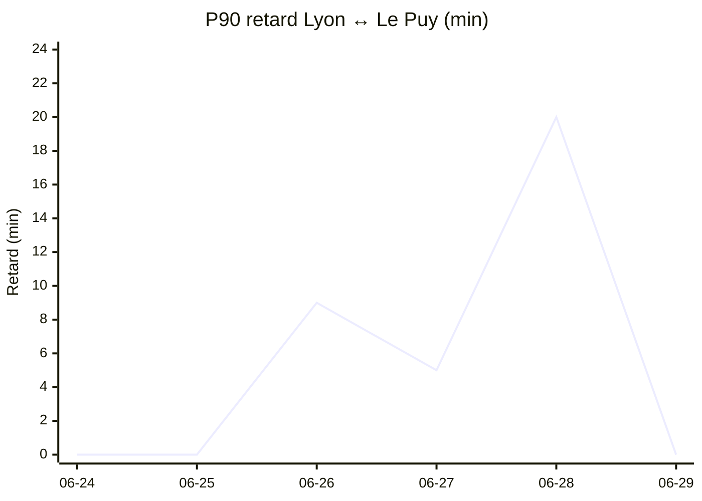
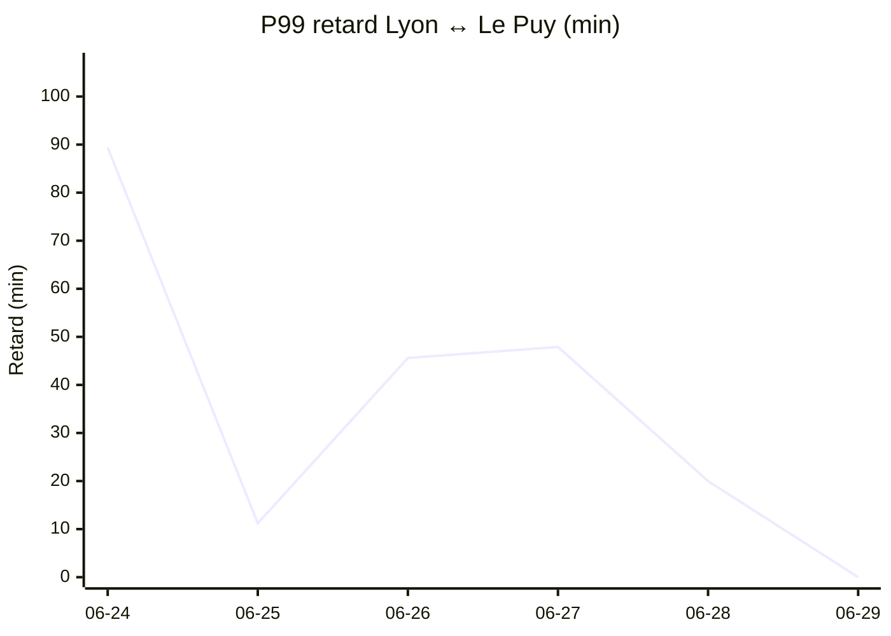

# Statistiques TER Lyon ↔ Le Puy

_Mis à jour le 2026-06-29 02:14 UTC — fenêtre des dernières 24 heures. Trains REGIONAURA uniquement._

## Vue d'ensemble

- **Trains observés** : 187
- **Trains annulés** : 1
- **Trains en retard ≥ 5 min ou annulés** : 9 (4.8 %)

- **Correspondances à St-Étienne Châteaucreux** : 260 analysées, **3 loupées** (1.2 %). Médiane retard ressenti à St-Étienne : 0.0 min.

## Distribution des retards à l'arrivée

**Périmètre :** TER REGIONAURA (Auvergne-Rhône-Alpes) sur l'axe Lyon ↔ Saint-Étienne ↔ Le Puy-en-Velay — trains qui passent par au moins 2 des 3 hubs (Lyon Part-Dieu/Perrache, Saint-Étienne Châteaucreux, Le Puy-en-Velay). Lignes C18 et P28 essentiellement. TGV, Intercités et trains hors-axe exclus. Annulations comptées au retard du prochain train de même direction. Hors correspondance (voir la section dédiée plus bas).

**3.2 % des trains arrivent avec un retard supérieur à 5 min** (fenêtre 24 h glissante).

| Percentile | Retard |
|---|---|
| 50 % | à l'heure |
| 80 % | à l'heure |
| 90 % | à l'heure |
| 95 % | à l'heure |
| 99 % | ≤ 16 min |

### P90 par jour _(le 10 % le plus en retard reste sous cette barre)_

### P99 par jour _(le pire 1 %, dominé par les retards lourds et annulations)_

### Percentiles par jour

| Jour | Trains | Annulés | % > 5 min | P50 | P80 | P90 | P95 | P99 |
|---|---|---|---|---|---|---|---|---|
| 2026-06-24 | 128 | 6 | 10.2 % | à l'heure | à l'heure | 6 min | 33 min | 60 min |
| 2026-06-25 | 128 | 4 | 11.7 % | à l'heure | 5 min | 10 min | 30 min | 55 min |
| 2026-06-26 | 128 | 0 | 3.9 % | à l'heure | à l'heure | 5 min | 5 min | 15 min |
| 2026-06-27 | 78 | 0 | 2.6 % | à l'heure | à l'heure | à l'heure | 5 min | 21 min |
| 2026-06-28 | 61 | 1 | 9.8 % | à l'heure | à l'heure | 5 min | 10 min | 36 min |
| 2026-06-29 | 125 | 0 | 0.0 % | à l'heure | à l'heure | à l'heure | à l'heure | à l'heure |

## Focus Lyon ↔ Le Puy (correspondance Saint-Étienne incluse)

51 trajets analysés (les deux sens fusionnés), dont 0 avec correspondance loupée. Le retard est mesuré à la gare d'arrivée finale, en prenant le train de substitution si la correspondance à Saint-Étienne a été ratée.

**5.9 %** des trajets avec un retard d'arrivée > 5 min.

| Percentile | Retard arrivée |
|---|---|
| 50 % | à l'heure |
| 80 % | à l'heure |
| 90 % | à l'heure |
| 95 % | ≤ 10 min |
| 99 % | ≤ 20 min |

## Évolution quotidienne Lyon ↔ Le Puy

Retard à l'arrivée par jour, les deux sens fusionnés. Le retard intègre l'effet d'une correspondance loupée à Saint-Étienne (= attente du prochain train pris).

### P90 par jour _(le 10 % le plus en retard reste sous cette barre)_

### P99 par jour _(le pire 1 %, dominé par les correspondances loupées)_

### Percentiles par jour

| Jour | Trajets | Loupées | P50 | P80 | P90 | P95 | P99 |
|---|---|---|---|---|---|---|---|
| 2026-06-24 | 37 | 2 | à l'heure | à l'heure | à l'heure | 16 min | 89 min |
| 2026-06-25 | 39 | 0 | à l'heure | à l'heure | à l'heure | 1 min | 11 min |
| 2026-06-26 | 40 | 1 | à l'heure | 5 min | 9 min | 45 min | 46 min |
| 2026-06-27 | 23 | 1 | à l'heure | à l'heure | 5 min | 5 min | 48 min |
| 2026-06-28 | 13 | 0 | à l'heure | 12 min | 20 min | 20 min | 20 min |
| 2026-06-29 | 38 | 0 | à l'heure | à l'heure | à l'heure | à l'heure | à l'heure |

📄 **Listes détaillées** (trains en retard + correspondances) : voir [DETAIL.md](DETAIL.md).
