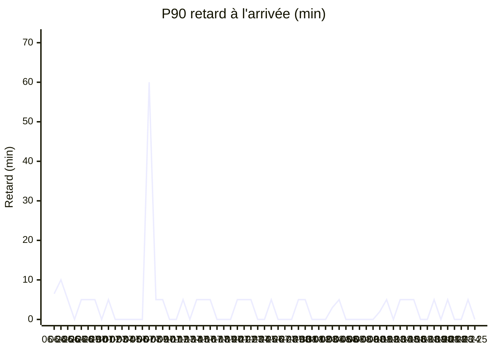
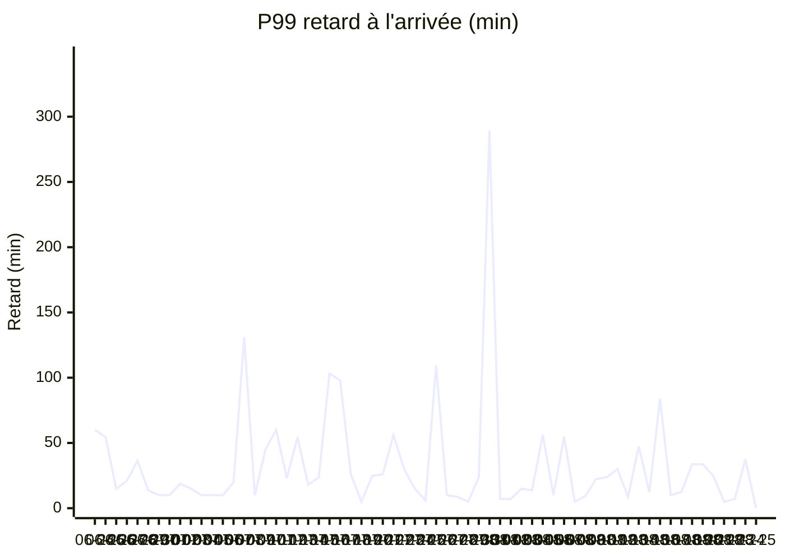
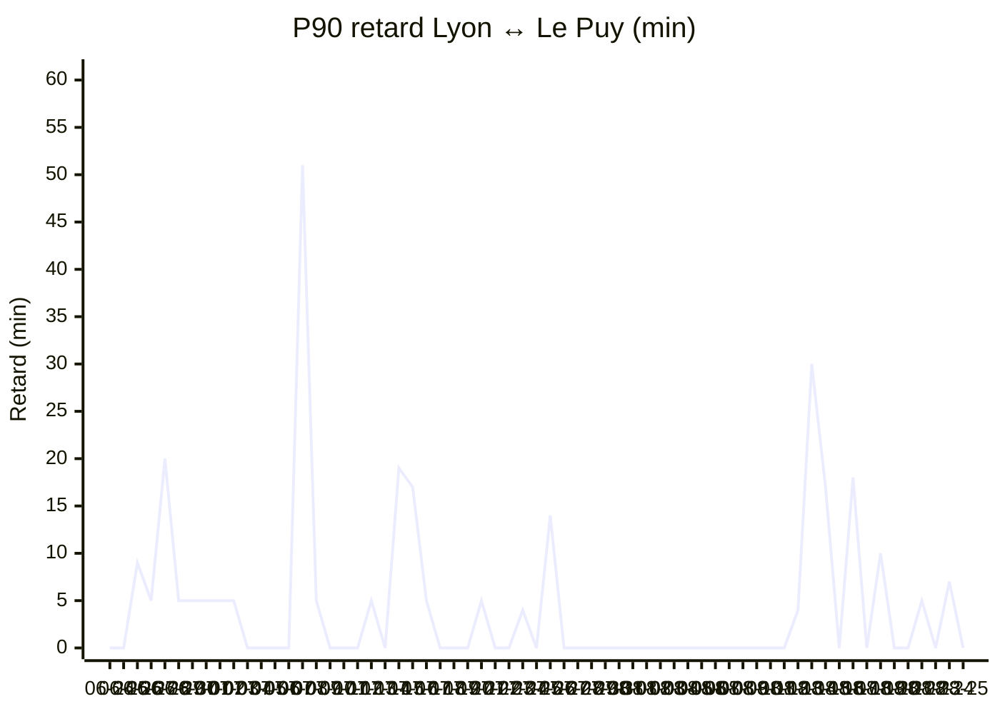
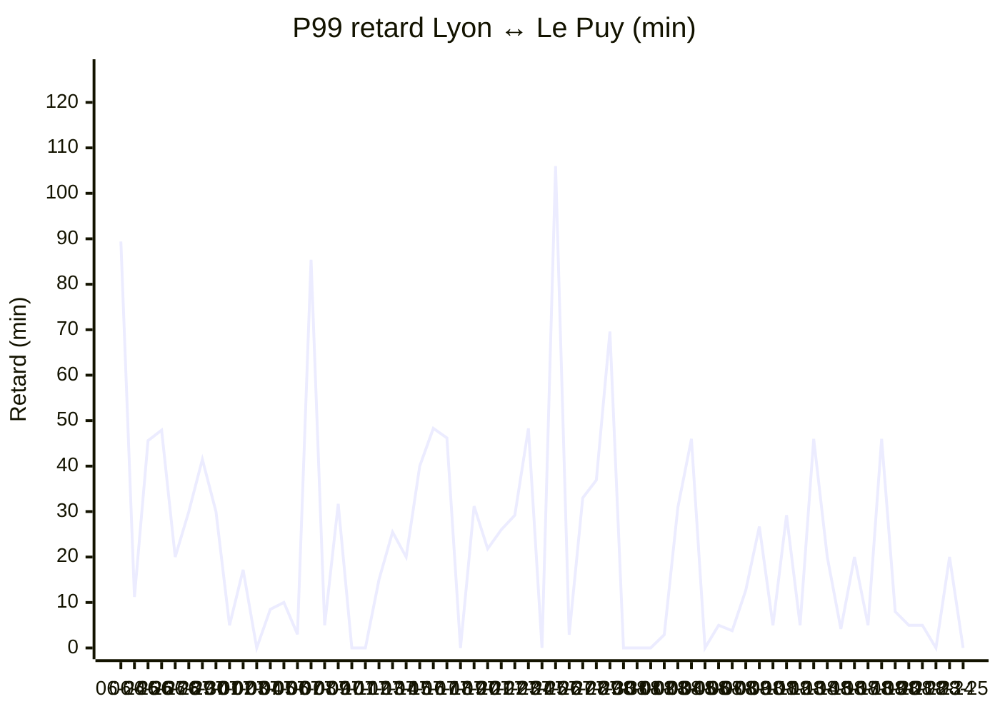

# Statistiques TER Lyon ↔ Le Puy

_Mis à jour le 2026-08-25 02:14 UTC — fenêtre des dernières 24 heures. Trains REGIONAURA uniquement._

## Vue d'ensemble

- **Trains observés** : 252
- **Trains annulés** : 2
- **Trains en retard ≥ 5 min ou annulés** : 14 (5.6 %)

- **Correspondances à St-Étienne Châteaucreux** : 387 analysées, **4 loupées** (1.0 %). Médiane retard ressenti à St-Étienne : 0.0 min.

## Distribution des retards à l'arrivée

**Périmètre :** TER REGIONAURA (Auvergne-Rhône-Alpes) sur l'axe Lyon ↔ Saint-Étienne ↔ Le Puy-en-Velay — trains qui passent par au moins 2 des 3 hubs (Lyon Part-Dieu/Perrache, Saint-Étienne Châteaucreux, Le Puy-en-Velay). Lignes C18 et P28 essentiellement. TGV, Intercités et trains hors-axe exclus. Annulations comptées au retard du prochain train de même direction. Hors correspondance (voir la section dédiée plus bas).

**2.4 % des trains arrivent avec un retard supérieur à 5 min** (fenêtre 24 h glissante).

| Percentile | Retard |
|---|---|
| 50 % | à l'heure |
| 80 % | à l'heure |
| 90 % | à l'heure |
| 95 % | ≤ 5 min |
| 99 % | ≤ 25 min |

### Par ligne (fenêtre 24 h)

| Ligne | Trains | Annulés | % > 5 min | P90 | P99 |
|---|---|---|---|---|---|
| C18 — Lyon ↔ St-Étienne | 130 | 2 | 3.1 % | à l'heure | 37 min |
| P28 — St-Étienne ↔ Le Puy | 42 | 0 | 4.8 % | 5 min | 18 min |
| C18+P28 (through-service) | 80 | 0 | 0.0 % | à l'heure | à l'heure |

### Par type de jour (tout l'historique)

| Type | Jours | Trains | Annulés | % > 5 min | P90 | P99 |
|---|---|---|---|---|---|---|
| Semaine | 44 | 5601 | 79 | 5.0 % | 5 min | 45 min |
| Weekend | 17 | 1174 | 8 | 2.8 % | à l'heure | 26 min |
| Férié | 2 | 140 | 0 | 4.3 % | 1 min | 16 min |

### P90 par jour _(le 10 % le plus en retard reste sous cette barre)_

```mermaid
xychart-beta
    title "P90 retard à l'arrivée (min)"
    x-axis ["06-24", "06-25", "06-26", "06-27", "06-28", "06-29", "06-30", "07-01", "07-02", "07-03", "07-04", "07-05", "07-06", "07-07", "07-08", "07-09", "07-10", "07-11", "07-12", "07-13", "07-14", "07-15", "07-16", "07-17", "07-18", "07-19", "07-20", "07-21", "07-22", "07-23", "07-24", "07-25", "07-26", "07-27", "07-28", "07-29", "07-30", "07-31", "08-01", "08-02", "08-03", "08-04", "08-05", "08-06", "08-07", "08-08", "08-09", "08-10", "08-11", "08-12", "08-13", "08-14", "08-15", "08-16", "08-17", "08-18", "08-19", "08-20", "08-21", "08-22", "08-23", "08-24", "08-25"]
    y-axis "Retard (min)" 0 --> 72
    line [6.5, 10.0, 5.0, 0.0, 5.0, 5.0, 5.0, 0.0, 5.0, 0.0, 0.0, 0.0, 0.0, 0.0, 60.0, 5.0, 5.0, 0.0, 0.0, 5.0, 0.0, 5.0, 5.0, 5.0, 0.0, 0.0, 0.0, 5.0, 5.0, 5.0, 0.0, 0.0, 5.0, 0.0, 0.0, 0.0, 5.0, 5.0, 0.0, 0.0, 0.0, 3.0, 5.0, 0.0, 0.0, 0.0, 0.0, 0.0, 2.0, 5.0, 0.0, 5.0, 5.0, 5.0, 0.0, 0.0, 5.0, 0.0, 5.0, 0.0, 0.0, 5.0, 0.0]
```

### P99 par jour _(le pire 1 %, dominé par les retards lourds et annulations)_

```mermaid
xychart-beta
    title "P99 retard à l'arrivée (min)"
    x-axis ["06-24", "06-25", "06-26", "06-27", "06-28", "06-29", "06-30", "07-01", "07-02", "07-03", "07-04", "07-05", "07-06", "07-07", "07-08", "07-09", "07-10", "07-11", "07-12", "07-13", "07-14", "07-15", "07-16", "07-17", "07-18", "07-19", "07-20", "07-21", "07-22", "07-23", "07-24", "07-25", "07-26", "07-27", "07-28", "07-29", "07-30", "07-31", "08-01", "08-02", "08-03", "08-04", "08-05", "08-06", "08-07", "08-08", "08-09", "08-10", "08-11", "08-12", "08-13", "08-14", "08-15", "08-16", "08-17", "08-18", "08-19", "08-20", "08-21", "08-22", "08-23", "08-24", "08-25"]
    y-axis "Retard (min)" 0 --> 347
    line [60.0, 54.6, 15.0, 20.8, 36.4, 13.7, 10.0, 10.0, 18.7, 15.0, 10.0, 10.0, 10.0, 19.6, 131.1, 10.0, 45.0, 60.0, 23.0, 54.4, 18.0, 23.6, 103.2, 98.1, 26.1, 5.0, 24.8, 26.1, 56.1, 30.0, 15.0, 6.1, 109.7, 10.0, 8.7, 5.0, 23.7, 289.4, 7.2, 7.0, 15.0, 13.8, 56.1, 10.0, 54.8, 5.0, 9.3, 22.4, 23.7, 30.0, 8.7, 47.4, 12.2, 84.0, 10.0, 12.4, 33.7, 33.7, 24.8, 5.0, 7.0, 37.5, 0.0]
```

### Percentiles par jour

| Jour | Type | Trains | Annulés | % > 5 min | P50 | P80 | P90 | P95 | P99 | Note |
|---|---|---|---|---|---|---|---|---|---|---|
| 2026-06-24 | semaine | 128 | 6 | 10.2 % | à l'heure | à l'heure | 6 min | 33 min | 60 min |  |
| 2026-06-25 | semaine | 128 | 4 | 11.7 % | à l'heure | 5 min | 10 min | 30 min | 55 min |  |
| 2026-06-26 | semaine | 128 | 0 | 3.9 % | à l'heure | à l'heure | 5 min | 5 min | 15 min |  |
| 2026-06-27 | weekend | 78 | 0 | 2.6 % | à l'heure | à l'heure | à l'heure | 5 min | 21 min |  |
| 2026-06-28 | weekend | 61 | 1 | 9.8 % | à l'heure | à l'heure | 5 min | 10 min | 36 min |  |
| 2026-06-29 | semaine | 128 | 0 | 2.3 % | à l'heure | à l'heure | 5 min | 5 min | 14 min |  |
| 2026-06-30 | semaine | 128 | 1 | 3.9 % | à l'heure | à l'heure | 5 min | 5 min | 10 min |  |
| 2026-07-01 | semaine | 128 | 0 | 3.1 % | à l'heure | à l'heure | à l'heure | 5 min | 10 min |  |
| 2026-07-02 | semaine | 128 | 0 | 4.7 % | à l'heure | à l'heure | 5 min | 5 min | 19 min |  |
| 2026-07-03 | semaine | 128 | 0 | 3.1 % | à l'heure | à l'heure | à l'heure | 5 min | 15 min |  |
| 2026-07-04 | weekend | 78 | 0 | 2.6 % | à l'heure | à l'heure | à l'heure | 1 min | 10 min |  |
| 2026-07-05 | weekend | 61 | 0 | 3.3 % | à l'heure | à l'heure | à l'heure | 5 min | 10 min |  |
| 2026-07-06 | semaine | 128 | 0 | 3.1 % | à l'heure | à l'heure | à l'heure | 5 min | 10 min |  |
| 2026-07-07 | semaine | 128 | 1 | 1.6 % | à l'heure | à l'heure | à l'heure | 5 min | 20 min |  |
| 2026-07-08 | semaine | 127 | 14 | 26.8 % | à l'heure | 30 min | 60 min | 70 min | 131 min | canicule |
| 2026-07-09 | semaine | 128 | 0 | 2.3 % | à l'heure | à l'heure | 5 min | 5 min | 10 min | canicule |
| 2026-07-10 | semaine | 125 | 3 | 5.6 % | à l'heure | à l'heure | 5 min | 9 min | 45 min |  |
| 2026-07-11 | weekend | 78 | 2 | 6.4 % | à l'heure | à l'heure | à l'heure | 11 min | 60 min |  |
| 2026-07-12 | weekend | 61 | 0 | 1.6 % | à l'heure | à l'heure | à l'heure | à l'heure | 23 min |  |
| 2026-07-13 | semaine | 129 | 3 | 5.4 % | à l'heure | à l'heure | 5 min | 8 min | 54 min |  |
| 2026-07-14 | férié | 61 | 0 | 4.9 % | à l'heure | à l'heure | à l'heure | 5 min | 18 min |  |
| 2026-07-15 | semaine | 129 | 0 | 7.0 % | à l'heure | à l'heure | 5 min | 13 min | 24 min |  |
| 2026-07-16 | semaine | 129 | 5 | 6.2 % | à l'heure | à l'heure | 5 min | 20 min | 103 min |  |
| 2026-07-17 | semaine | 129 | 2 | 3.9 % | à l'heure | à l'heure | 5 min | 5 min | 98 min | orages |
| 2026-07-18 | weekend | 79 | 0 | 2.5 % | à l'heure | à l'heure | à l'heure | à l'heure | 26 min |  |
| 2026-07-19 | weekend | 61 | 0 | 0.0 % | à l'heure | à l'heure | à l'heure | à l'heure | 5 min |  |
| 2026-07-20 | semaine | 127 | 1 | 3.1 % | à l'heure | à l'heure | à l'heure | 5 min | 25 min |  |
| 2026-07-21 | semaine | 127 | 1 | 6.3 % | à l'heure | à l'heure | 5 min | 10 min | 26 min |  |
| 2026-07-22 | semaine | 127 | 3 | 5.5 % | à l'heure | à l'heure | 5 min | 8 min | 56 min |  |
| 2026-07-23 | semaine | 127 | 3 | 6.3 % | à l'heure | à l'heure | 5 min | 10 min | 30 min |  |
| 2026-07-24 | semaine | 127 | 0 | 3.1 % | à l'heure | à l'heure | à l'heure | 5 min | 15 min |  |
| 2026-07-25 | weekend | 79 | 0 | 1.3 % | à l'heure | à l'heure | à l'heure | à l'heure | 6 min |  |
| 2026-07-26 | weekend | 60 | 1 | 8.3 % | à l'heure | à l'heure | 5 min | 30 min | 110 min |  |
| 2026-07-27 | semaine | 127 | 0 | 3.9 % | à l'heure | à l'heure | à l'heure | 5 min | 10 min |  |
| 2026-07-28 | semaine | 127 | 0 | 1.6 % | à l'heure | à l'heure | à l'heure | à l'heure | 9 min |  |
| 2026-07-29 | semaine | 127 | 0 | 0.8 % | à l'heure | à l'heure | à l'heure | à l'heure | 5 min |  |
| 2026-07-30 | semaine | 127 | 1 | 4.7 % | à l'heure | à l'heure | 5 min | 5 min | 24 min |  |
| 2026-07-31 | semaine | 127 | 8 | 9.4 % | à l'heure | à l'heure | 5 min | 30 min | 289 min |  |
| 2026-08-01 | weekend | 79 | 0 | 1.3 % | à l'heure | à l'heure | à l'heure | à l'heure | 7 min |  |
| 2026-08-02 | weekend | 61 | 0 | 1.6 % | à l'heure | à l'heure | à l'heure | 5 min | 7 min |  |
| 2026-08-03 | semaine | 127 | 1 | 3.9 % | à l'heure | à l'heure | à l'heure | 5 min | 15 min |  |
| 2026-08-04 | semaine | 125 | 2 | 4.8 % | à l'heure | à l'heure | 3 min | 5 min | 14 min |  |
| 2026-08-05 | semaine | 127 | 5 | 9.4 % | à l'heure | à l'heure | 5 min | 23 min | 56 min |  |
| 2026-08-06 | semaine | 127 | 0 | 2.4 % | à l'heure | à l'heure | à l'heure | 5 min | 10 min |  |
| 2026-08-07 | semaine | 127 | 2 | 5.5 % | à l'heure | à l'heure | à l'heure | 15 min | 55 min |  |
| 2026-08-08 | weekend | 79 | 0 | 0.0 % | à l'heure | à l'heure | à l'heure | à l'heure | 5 min |  |
| 2026-08-09 | weekend | 58 | 3 | 1.7 % | à l'heure | à l'heure | à l'heure | 5 min | 9 min |  |
| 2026-08-10 | semaine | 127 | 0 | 3.9 % | à l'heure | à l'heure | à l'heure | 5 min | 22 min |  |
| 2026-08-11 | semaine | 127 | 1 | 3.1 % | à l'heure | à l'heure | 2 min | 5 min | 24 min |  |
| 2026-08-12 | semaine | 127 | 2 | 4.7 % | à l'heure | à l'heure | 5 min | 5 min | 30 min |  |
| 2026-08-13 | semaine | 127 | 0 | 1.6 % | à l'heure | à l'heure | à l'heure | 5 min | 9 min |  |
| 2026-08-14 | semaine | 127 | 3 | 7.9 % | à l'heure | à l'heure | 5 min | 22 min | 47 min |  |
| 2026-08-15 | férié | 79 | 0 | 3.8 % | à l'heure | à l'heure | 5 min | 5 min | 12 min |  |
| 2026-08-16 | weekend | 61 | 1 | 4.9 % | à l'heure | à l'heure | 5 min | 5 min | 84 min |  |
| 2026-08-17 | semaine | 127 | 0 | 2.4 % | à l'heure | à l'heure | à l'heure | 5 min | 10 min |  |
| 2026-08-18 | semaine | 127 | 0 | 1.6 % | à l'heure | à l'heure | à l'heure | 5 min | 12 min |  |
| 2026-08-19 | semaine | 127 | 2 | 9.4 % | à l'heure | à l'heure | 5 min | 10 min | 34 min |  |
| 2026-08-20 | semaine | 127 | 1 | 3.9 % | à l'heure | à l'heure | à l'heure | 5 min | 34 min |  |
| 2026-08-21 | semaine | 127 | 2 | 2.4 % | à l'heure | à l'heure | 5 min | 5 min | 25 min |  |
| 2026-08-22 | weekend | 79 | 0 | 0.0 % | à l'heure | à l'heure | à l'heure | à l'heure | 5 min |  |
| 2026-08-23 | weekend | 61 | 0 | 1.6 % | à l'heure | à l'heure | à l'heure | à l'heure | 7 min |  |
| 2026-08-24 | semaine | 126 | 2 | 4.8 % | à l'heure | à l'heure | 5 min | 5 min | 38 min |  |
| 2026-08-25 | semaine | 126 | 0 | 0.0 % | à l'heure | à l'heure | à l'heure | à l'heure | à l'heure |  |

**Contexte des jours annotés :**
- **2026-07-08** — Vague de chaleur, 40 °C vallée du Rhône. SNCF a réduit son plan de transport aux heures chaudes (14 h-19 h). Alerte orange sur 67 départements le 9/07.
- **2026-07-09** — Suite de la canicule, alerte orange nationale, plusieurs départements du Sud-Est en alerte rouge.
- **2026-07-17** — Orages violents en AURA : interruptions Lyon-Bourg-en-Bresse (Villars-les-Dombes), Lyon-Roanne (Régny), Lyon-Annecy.

## Motifs de retard (fenêtre 24 h)

_Motifs remontés par l'API SNCF `/disruptions` pour les trains en retard ≥ 5 min ou annulés sur la fenêtre. Un motif = un train._

**12/14** trains perturbés associés à un motif.

| Trains | Effet | Motif |
|---|---|---|
| 4 | SIGNIFICANT_DELAYS | Réutilisation d'un train |
| 3 | SIGNIFICANT_DELAYS | Incident lors de la préparation du train |
| 1 | REDUCED_SERVICE | Panne d'une installation du réseau ferré |
| 1 | SIGNIFICANT_DELAYS | Saturation des voies en gare |
| 1 | SIGNIFICANT_DELAYS | Défaillance de matériel |
| 1 | REDUCED_SERVICE | Défaillance de matériel |
| 1 | NO_SERVICE | Panne d'une installation du réseau ferré |

## Focus Lyon ↔ Le Puy (correspondance Saint-Étienne incluse)

79 trajets analysés (les deux sens fusionnés), dont 0 avec correspondance loupée. Le retard est mesuré à la gare d'arrivée finale, en prenant le train de substitution si la correspondance à Saint-Étienne a été ratée.

**5.1 %** des trajets avec un retard d'arrivée > 5 min.

| Percentile | Retard arrivée |
|---|---|
| 50 % | à l'heure |
| 80 % | à l'heure |
| 90 % | à l'heure |
| 95 % | ≤ 6 min |
| 99 % | ≤ 20 min |

## Évolution quotidienne Lyon ↔ Le Puy

Retard à l'arrivée par jour, les deux sens fusionnés. Le retard intègre l'effet d'une correspondance loupée à Saint-Étienne (= attente du prochain train pris).

### P90 par jour _(le 10 % le plus en retard reste sous cette barre)_

```mermaid
xychart-beta
    title "P90 retard Lyon ↔ Le Puy (min)"
    x-axis ["06-24", "06-25", "06-26", "06-27", "06-28", "06-29", "06-30", "07-01", "07-02", "07-03", "07-04", "07-05", "07-06", "07-07", "07-08", "07-09", "07-10", "07-11", "07-12", "07-13", "07-14", "07-15", "07-16", "07-17", "07-18", "07-19", "07-20", "07-21", "07-22", "07-23", "07-24", "07-25", "07-26", "07-27", "07-28", "07-29", "07-30", "07-31", "08-01", "08-02", "08-03", "08-04", "08-05", "08-06", "08-07", "08-08", "08-09", "08-10", "08-11", "08-12", "08-13", "08-14", "08-15", "08-16", "08-17", "08-18", "08-19", "08-20", "08-21", "08-22", "08-23", "08-24", "08-25"]
    y-axis "Retard (min)" 0 --> 61
    line [0.0, 0.0, 9.0, 5.0, 20.0, 5.0, 5.0, 5.0, 5.0, 5.0, 0.0, 0.0, 0.0, 0.0, 51.0, 5.0, 0.0, 0.0, 0.0, 5.0, 0.0, 19.0, 17.0, 5.0, 0.0, 0.0, 0.0, 5.0, 0.0, 0.0, 4.0, 0.0, 14.0, 0.0, 0.0, 0.0, 0.0, 0.0, 0.0, 0.0, 0.0, 0.0, 0.0, 0.0, 0.0, 0.0, 0.0, 0.0, 0.0, 0.0, 4.0, 30.0, 17.0, 0.0, 18.0, 0.0, 10.0, 0.0, 0.0, 5.0, 0.0, 7.0, 0.0]
```

### P99 par jour _(le pire 1 %, dominé par les correspondances loupées)_

```mermaid
xychart-beta
    title "P99 retard Lyon ↔ Le Puy (min)"
    x-axis ["06-24", "06-25", "06-26", "06-27", "06-28", "06-29", "06-30", "07-01", "07-02", "07-03", "07-04", "07-05", "07-06", "07-07", "07-08", "07-09", "07-10", "07-11", "07-12", "07-13", "07-14", "07-15", "07-16", "07-17", "07-18", "07-19", "07-20", "07-21", "07-22", "07-23", "07-24", "07-25", "07-26", "07-27", "07-28", "07-29", "07-30", "07-31", "08-01", "08-02", "08-03", "08-04", "08-05", "08-06", "08-07", "08-08", "08-09", "08-10", "08-11", "08-12", "08-13", "08-14", "08-15", "08-16", "08-17", "08-18", "08-19", "08-20", "08-21", "08-22", "08-23", "08-24", "08-25"]
    y-axis "Retard (min)" 0 --> 127
    line [89.4, 11.2, 45.6, 47.9, 20.0, 30.0, 41.5, 30.0, 5.0, 17.2, 0.0, 8.5, 10.0, 3.0, 85.4, 5.0, 31.7, 0.0, 0.0, 15.0, 25.5, 20.0, 40.0, 48.3, 46.2, 0.0, 31.2, 21.8, 26.0, 29.2, 48.3, 0.0, 106.0, 2.9, 33.0, 36.9, 69.6, 0.0, 0.0, 0.0, 2.9, 30.9, 46.0, 0.0, 5.0, 3.8, 12.7, 26.7, 5.0, 29.2, 5.0, 46.0, 20.0, 4.2, 20.0, 5.0, 46.0, 8.0, 5.0, 5.0, 0.0, 20.0, 0.0]
```

### Percentiles par jour

| Jour | Trajets | Loupées | P50 | P80 | P90 | P95 | P99 |
|---|---|---|---|---|---|---|---|
| 2026-06-24 | 37 | 2 | à l'heure | à l'heure | à l'heure | 16 min | 89 min |
| 2026-06-25 | 39 | 0 | à l'heure | à l'heure | à l'heure | 1 min | 11 min |
| 2026-06-26 | 40 | 1 | à l'heure | 5 min | 9 min | 45 min | 46 min |
| 2026-06-27 | 23 | 1 | à l'heure | à l'heure | 5 min | 5 min | 48 min |
| 2026-06-28 | 13 | 0 | à l'heure | 12 min | 20 min | 20 min | 20 min |
| 2026-06-29 | 40 | 1 | à l'heure | 1 min | 5 min | 5 min | 30 min |
| 2026-06-30 | 38 | 1 | à l'heure | 5 min | 5 min | 10 min | 42 min |
| 2026-07-01 | 40 | 0 | à l'heure | à l'heure | 5 min | 6 min | 30 min |
| 2026-07-02 | 40 | 0 | à l'heure | à l'heure | 5 min | 5 min | 5 min |
| 2026-07-03 | 40 | 0 | à l'heure | à l'heure | 5 min | 5 min | 17 min |
| 2026-07-04 | 23 | 0 | à l'heure | à l'heure | à l'heure | à l'heure | à l'heure |
| 2026-07-05 | 16 | 0 | à l'heure | à l'heure | à l'heure | 2 min | 8 min |
| 2026-07-06 | 41 | 0 | à l'heure | à l'heure | à l'heure | 10 min | 10 min |
| 2026-07-07 | 40 | 0 | à l'heure | à l'heure | à l'heure | à l'heure | 3 min |
| 2026-07-08 | 34 | 7 | à l'heure | 24 min | 51 min | 61 min | 85 min |
| 2026-07-09 | 41 | 0 | à l'heure | 5 min | 5 min | 5 min | 5 min |
| 2026-07-10 | 39 | 0 | à l'heure | à l'heure | à l'heure | 6 min | 32 min |
| 2026-07-11 | 21 | 0 | à l'heure | à l'heure | à l'heure | à l'heure | à l'heure |
| 2026-07-12 | 16 | 0 | à l'heure | à l'heure | à l'heure | à l'heure | à l'heure |
| 2026-07-13 | 43 | 0 | à l'heure | 3 min | 5 min | 5 min | 15 min |
| 2026-07-14 | 16 | 0 | à l'heure | à l'heure | à l'heure | 8 min | 25 min |
| 2026-07-15 | 43 | 0 | à l'heure | 5 min | 19 min | 20 min | 20 min |
| 2026-07-16 | 43 | 0 | à l'heure | 5 min | 17 min | 40 min | 40 min |
| 2026-07-17 | 40 | 2 | à l'heure | à l'heure | 5 min | 6 min | 48 min |
| 2026-07-18 | 24 | 1 | à l'heure | à l'heure | à l'heure | à l'heure | 46 min |
| 2026-07-19 | 17 | 0 | à l'heure | à l'heure | à l'heure | à l'heure | à l'heure |
| 2026-07-20 | 42 | 1 | à l'heure | à l'heure | à l'heure | 9 min | 31 min |
| 2026-07-21 | 42 | 0 | à l'heure | à l'heure | 5 min | 10 min | 22 min |
| 2026-07-22 | 41 | 0 | à l'heure | à l'heure | à l'heure | à l'heure | 26 min |
| 2026-07-23 | 42 | 1 | à l'heure | à l'heure | à l'heure | à l'heure | 29 min |
| 2026-07-24 | 43 | 1 | à l'heure | à l'heure | 4 min | 10 min | 48 min |
| 2026-07-25 | 24 | 0 | à l'heure | à l'heure | à l'heure | à l'heure | à l'heure |
| 2026-07-26 | 15 | 1 | à l'heure | 1 min | 14 min | 50 min | 106 min |
| 2026-07-27 | 43 | 0 | à l'heure | à l'heure | à l'heure | à l'heure | 3 min |
| 2026-07-28 | 43 | 1 | à l'heure | à l'heure | à l'heure | à l'heure | 33 min |
| 2026-07-29 | 43 | 1 | à l'heure | à l'heure | à l'heure | à l'heure | 37 min |
| 2026-07-30 | 43 | 1 | à l'heure | à l'heure | à l'heure | à l'heure | 70 min |
| 2026-07-31 | 42 | 0 | à l'heure | à l'heure | à l'heure | à l'heure | à l'heure |
| 2026-08-01 | 24 | 0 | à l'heure | à l'heure | à l'heure | à l'heure | à l'heure |
| 2026-08-02 | 17 | 0 | à l'heure | à l'heure | à l'heure | à l'heure | à l'heure |
| 2026-08-03 | 43 | 0 | à l'heure | à l'heure | à l'heure | à l'heure | 3 min |
| 2026-08-04 | 43 | 1 | à l'heure | à l'heure | à l'heure | à l'heure | 31 min |
| 2026-08-05 | 43 | 2 | à l'heure | à l'heure | à l'heure | 15 min | 46 min |
| 2026-08-06 | 43 | 0 | à l'heure | à l'heure | à l'heure | à l'heure | à l'heure |
| 2026-08-07 | 41 | 0 | à l'heure | à l'heure | à l'heure | 5 min | 5 min |
| 2026-08-08 | 24 | 0 | à l'heure | à l'heure | à l'heure | à l'heure | 4 min |
| 2026-08-09 | 16 | 0 | à l'heure | à l'heure | à l'heure | 4 min | 13 min |
| 2026-08-10 | 43 | 1 | à l'heure | à l'heure | à l'heure | à l'heure | 27 min |
| 2026-08-11 | 42 | 0 | à l'heure | à l'heure | à l'heure | à l'heure | 5 min |
| 2026-08-12 | 42 | 1 | à l'heure | à l'heure | à l'heure | 5 min | 29 min |
| 2026-08-13 | 43 | 0 | à l'heure | à l'heure | 4 min | 5 min | 5 min |
| 2026-08-14 | 41 | 1 | à l'heure | 5 min | 30 min | 40 min | 46 min |
| 2026-08-15 | 24 | 0 | à l'heure | 7 min | 17 min | 20 min | 20 min |
| 2026-08-16 | 16 | 0 | à l'heure | à l'heure | à l'heure | 1 min | 4 min |
| 2026-08-17 | 43 | 0 | à l'heure | à l'heure | 18 min | 20 min | 20 min |
| 2026-08-18 | 43 | 0 | à l'heure | à l'heure | à l'heure | 5 min | 5 min |
| 2026-08-19 | 41 | 2 | à l'heure | à l'heure | 10 min | 10 min | 46 min |
| 2026-08-20 | 41 | 0 | à l'heure | à l'heure | à l'heure | 5 min | 8 min |
| 2026-08-21 | 42 | 0 | à l'heure | à l'heure | à l'heure | 5 min | 5 min |
| 2026-08-22 | 24 | 0 | à l'heure | à l'heure | 5 min | 5 min | 5 min |
| 2026-08-23 | 16 | 0 | à l'heure | à l'heure | à l'heure | à l'heure | à l'heure |
| 2026-08-24 | 39 | 0 | à l'heure | à l'heure | 7 min | 16 min | 20 min |
| 2026-08-25 | 40 | 0 | à l'heure | à l'heure | à l'heure | à l'heure | à l'heure |

📄 **Listes détaillées** (trains en retard + correspondances) : voir [DETAIL.md](DETAIL.md).
